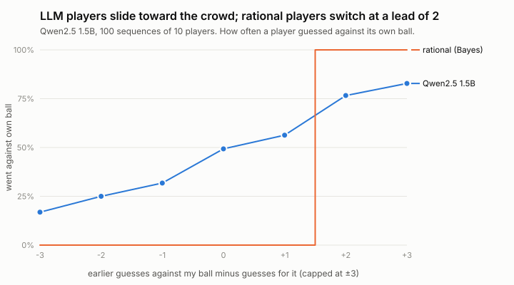

# 09: Information cascades with an LLM (Qwen2.5 1.5B)

**Page:** `lab/cascade.html`. **Data:** `lab/public/results/cascade-qwen2-5-1-5b-instruct-t07.json`. **Rule-based reference:** [03](03-information-cascades.md).

## The question

In the urn game, rational players herd into a wrong answer about 1 time in 5 ([03](03-information-cascades.md)). Where does a small language model sit between "ignore others", "rational herding" and something else?

## Version 1: urns named "A" and "B"

The prompt describes both urns ("Urn A contains 2 red balls and 1 blue ball…"), tells the player the colour of their ball and the earlier guesses, and asks for "A" or "B". The colour-to-urn mapping and the order the urns are described in are counterbalanced across sequences. 88 sequences of 10 players, temperature 0.7.

| Measure | Qwen2.5 1.5B | Follow-own-ball player | Rational player |
|---|---|---|---|
| **Player 1** (no social information) guesses their own ball's urn | **52%** | 100% | 100% |
| Accuracy over all guesses | **49%** | 67% | 76% |
| Guesses own ball's urn when there's no rational cascade | 48% | 100% | 100% |
| Same guess as the previous player | 54% | – | – |
| Guessed "A" | 54% (65% for player 1) | 50% | 50% |

**Result: chance level.** The model doesn't link "I drew a red ball" to "the urn with more red balls", even with no social information to confuse it. So there's no herding to study. The one systematic signal is a mild lean toward answering "A" (65% for player 1), the same kind of label/position bias as in the naming game ([05](05-individual-bias.md)).

## Protocol note (honesty)

The page hot-reloaded at sequence 89, because I edited code it imports. It resumed from its checkpoint, but sequences 89–100 ran with a slightly changed prompt (answer options listed in the order the urns were described). Only sequences 0–87 are analysed as version 1. Lesson: never edit modules a running experiment imports.

## Version 2: urns named by their majority colour

"The red urn contains 2 red balls and 1 blue ball…". Earlier guesses are reported as "red, red, blue", and the answer is a colour. Following your own ball now means just repeating its colour. 100 sequences of 10 players. **Data:** `cascade-qwen2-5-1-5b-instruct-t07-colours.json`.

| Measure | v1 (A/B labels) | **v2 (colour labels)** | Follow-own-ball player | Rational player |
|---|---|---|---|---|
| Player 1 guesses its own ball | 52% | **70%** | 100% | 100% |
| Guesses own ball when there's no rational cascade | 48% | 60% | 100% | 100% |
| **Joins the crowd when a rational player would** (against own ball) | – | **77%** | 0% | 100% |
| Accuracy over all guesses | 49% | **52%** | 67% | 76% |
| Last 3 players all wrong | – | **31%** | 0% | about 19% |

### What happened

1. **Naming the urns by colour helped the individual step.** Player 1 now follows its evidence 70% of the time: not reliable, but well above chance.
2. **The model herds, but not like a rational player.** A rational player ignores the crowd until it leads by 2, then follows it completely: a step. The model follows a **smooth conformity curve**. The more earlier guesses oppose its ball, the likelier it gives in: 17% when the crowd agrees with it by 3, 49% when the crowd is split evenly, 56% with a lead of just one against it, 83% with a lead of three.
3. **Social information made the group *worse*.** LLM players were right 52% of the time: worse than ignoring everyone (67%), and far worse than rational herding (76%). The last three players were all wrong in 31% of sequences, against about 19% for rational players.

### Why the group gets worse

Two things combine. Each player's own reading of its ball is noisy (70% at best), so early guesses are often wrong, *and* later players conform to early guesses even on a lead of one. A rational player only joins a cascade built on two independent pieces of evidence. The model joins one built on a single noisy guess, and then its own guess adds to the lead the next player sees. Errors snowball. **Every player sees more information than player 1, yet the group ends up less accurate than if nobody had looked.** That's an emergent harm: nobody's individual rule is "be wrong", but the social process produces wrongness.

### Caveats

- One model, one temperature, 100 sequences. The conformity curve's shape should be checked against a second model and T=0.
- The colour framing makes following your own ball a matter of repeating a word. Some of the "herding" may be the same repeat-what's-in-context habit seen in the naming game ([08](08-probes-and-biased-copying.md)): the prompt with "red, red, red" in it pulls toward "red". That's still herding by effect, but perhaps not by reasoning.

## What this says about emergence with small models

A population can only show a social phenomenon if its members can do the individual step first. In the naming game the individual step is trivial ("say a name"), so we see population dynamics, albeit stubborn ones. In the cascade game the individual step is an inference that 1.5B parameters apparently can't make in this framing. **Capability floors decide which collective phenomena are even reachable.** That's the same question as condition C (0.5B) in the plan.
