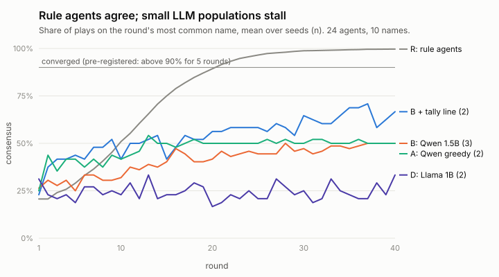

# Experiment notes

**New here? Read the interactive explainer first:** [`article/how-crowds-make-up-their-minds.html`](../article/how-crowds-make-up-their-minds.html).

## What we've learned so far (plain language)

*Updated as results come in. Each point links to the note with the evidence.*

1. **Simple agents do form conventions.** Agents that copy whatever their recent partners played most often agree on one name within about 20 rounds, with nobody in charge and nobody seeing the whole group ([00](00-rule-baseline.md)).
2. **Small language models, so far, do not fully converge, but one name does pull ahead.** In 3 of 3 runs, Qwen2.5 1.5B agents split into Q and T camps, and Q, the model's favourite name on its own, took the lead, reaching a majority in 2 runs ([01](01-first-llm-seed.md)). The reason is visible in their choices: after a mismatch they keep their own name 71% of the time and adopt their partner's only 3%.
3. **The camps weren't emergent; they were inherited.** On its own, with no history, Qwen 1.5B already favours Q and T, and its populations drift to Q and T. Qwen 0.5B favours W and J, and its populations drift to W and J ([05](05-individual-bias.md)). It also picks the first name listed 62% of the time, which is why every prompt shuffles the list.
4. **What an agent needs for a convention to form** ([06](06-habits.md)): always repeat a winning name, sometimes (not always) copy a partner who beat you, and almost never pick at random. Sampled LLM agents wander off even after winning, and that noise alone can keep a population below our 90% "converged" line. That's a flag on the measure as well as on the agents.
5. **Tipping points are cliffs, and memory sets where the cliff is.** Overturning a convention takes 13–29% committed agents depending on how many rounds agents remember. Below that, nothing happens; a couple more agents, and it always flips ([00](00-rule-baseline.md), [07](07-tipping-vs-memory.md)).
6. **The same lesson shows up in three classic models.** Mild preferences produce strong segregation ([02](02-schelling.md)); rational people herd into wrong answers about 1 time in 5 ([03](03-information-cascades.md)); a crowd self-organises around a bar's capacity only if its members think differently, and a monoculture fails completely ([04](04-el-farol.md)).

7. **Why the LLM populations behave this way** ([08](08-probes-and-biased-copying.md)): given a scripted history of 5 losses to partners who all played Y, the model plays its own name again 92% of the time. It repeats itself, whatever the payoff. And when agents do copy a partner, they are about 3 times more likely to copy a name they already like. Social influence filtered by personal taste is how an individual preference becomes the group's convention.

8. **LLM players herd, and it makes the group worse** ([09](09-llm-cascades.md)). In the urn-guessing game, once the urns were named by colour, Qwen2.5 1.5B followed a smooth conformity curve: the more earlier players disagreed with its evidence, the likelier it gave in, even against a lead of one. Rational players only give in at a lead of two. The result: LLM players were right 52% of the time, *worse* than ignoring everyone (67%), and the last three were all wrong in 31% of games. Llama shows the same pattern. With greedy decoding, Qwen's herding becomes a perfectly rational-looking step, but its first player always answers "blue", and the crowd faithfully amplifies that quirk into the worst group of all (41% wrong lock-ins). With the urns labelled "A" and "B", the model couldn't use its own evidence at all (52% on the first guess), a reminder that capability floors decide which social effects are reachable.

9. **Stubborn or fickle depends on the prompt as much as the model** ([10](10-stubborn-vs-fickle.md)). Under one wording Qwen 1.5B is stubborn: it repeats its name even after five losses, so camps freeze. Under another it's fickle, abandoning winning names 88% of the time. Llama 1B and Qwen 0.5B each sit somewhere else again. The one habit that never changes: **no model, under any wording, copies its partners more than about a fifth of the time**, and that's the ingredient every converging population needs. (I first attributed stubbornness to the model; the prompt-overlap check corrected that.)

10. **Copying switches on between 3B and 7B, and bigger models converge** ([11](11-size-ladder.md)). After five losses to partners who all played Y, Qwen 1.5B copies 1% of the time, Qwen 7B 63%, Gemma 4 26B 98%. All three Gemma 26B populations converged (on F, X and Z), with the same S-curve as the rule agents; their habits (always repeat a winner, copy about 25% after a loss, almost never explore) sit exactly where the habit map said conventions form. Qwen 7B converged once its own past picks were hidden from its memory. A committed minority of 21% overturned a Gemma convention within 12 rounds; 12.5% did not.

## Index

Working notes, in the order they were written. [`journal.md`](journal.md) is the running log, and each experiment gets its own file.

| # | Note | Status |
|---|---|---|
| 00 | [Rule-based reference (condition R)](00-rule-baseline.md) | done |
| 01 | [Condition B: Qwen2.5 1.5B, T=0.7](01-first-llm-seed.md) | seeds 0–2 done |
| 02 | [Schelling segregation](02-schelling.md) | done (rule-based) |
| 03 | [Information cascades](03-information-cascades.md) | done (rule-based); LLM version planned |
| 04 | [El Farol bar](04-el-farol.md) | done (rule-based) |
| 05 | [Individual bias baseline (Qwen2.5 1.5B)](05-individual-bias.md) | done |
| 06 | [Habits: what an agent must do for a convention](06-habits.md) | done (CPU); probes next |
| 07 | [Critical mass depends on memory length](07-tipping-vs-memory.md) | done (CPU) |
| 08 | [Probes: why LLM agents don't converge, and why Q wins](08-probes-and-biased-copying.md) | done (exploratory) |
| 09 | [Information cascades with an LLM](09-llm-cascades.md) | done: v1 chance level; v2 conformity curve |
| 10 | [Stubborn vs fickle: Qwen, greedy Qwen, Llama](10-stubborn-vs-fickle.md) | full grid: 5 seeds each of A–E, 0/25 converged (see journal) |
| 11 | [Size ladder: where copying switches on](11-size-ladder.md) | done: probes 1.5B–31B; Gemma 3/3 converge; Qwen 7B converges with partner-only memory; Gemma tipping |
